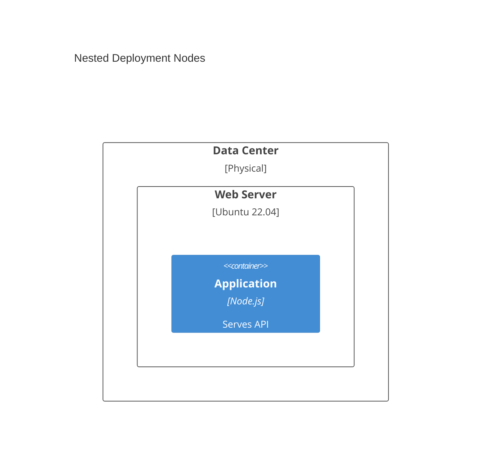
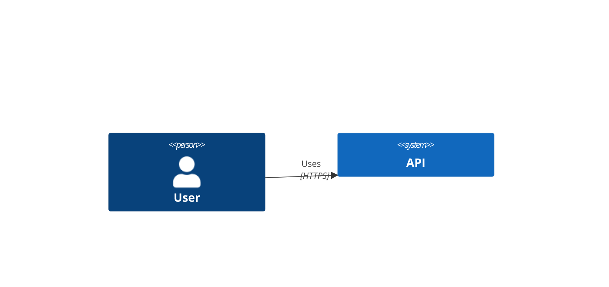
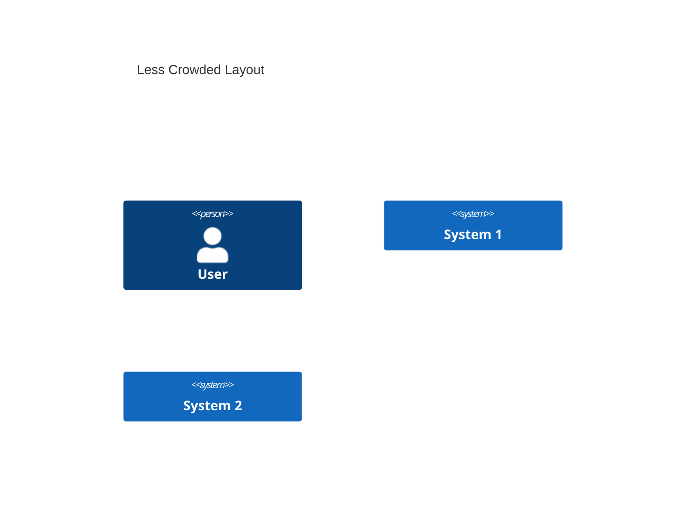
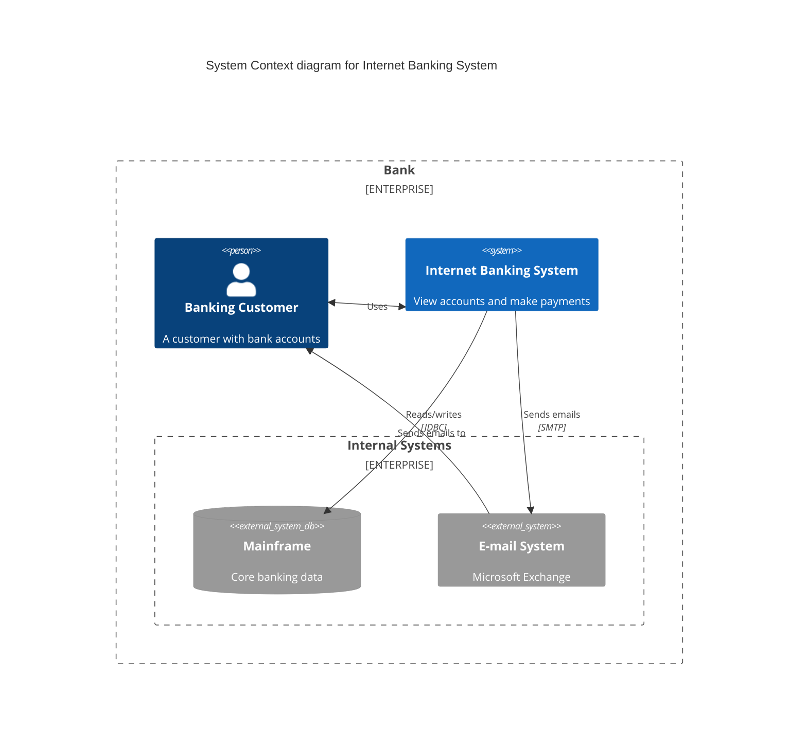
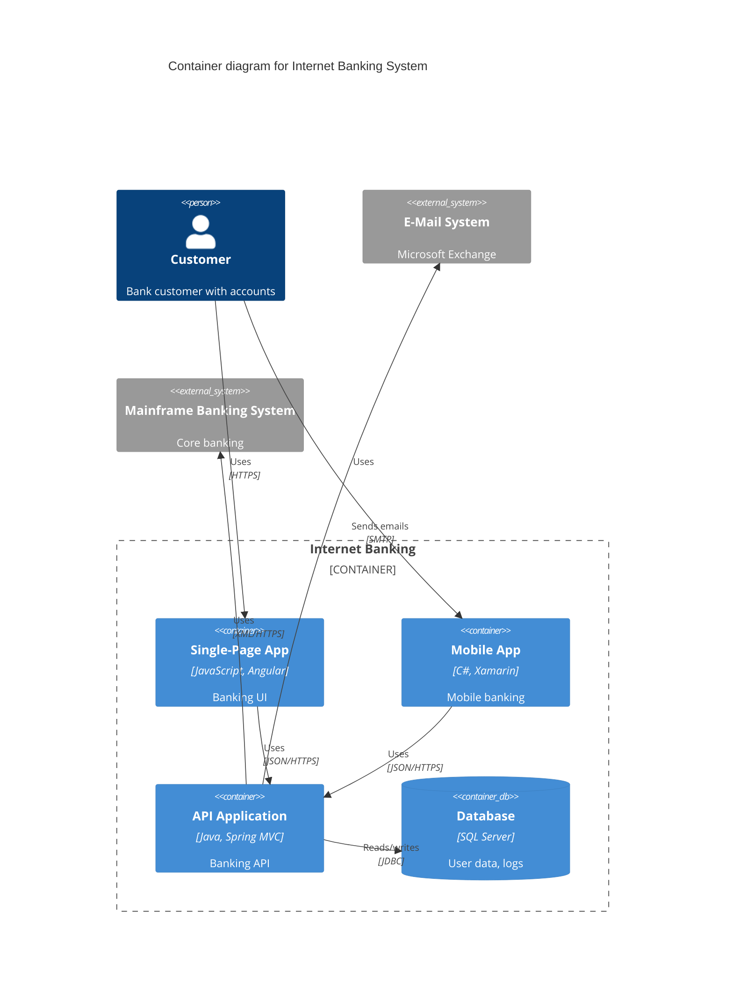
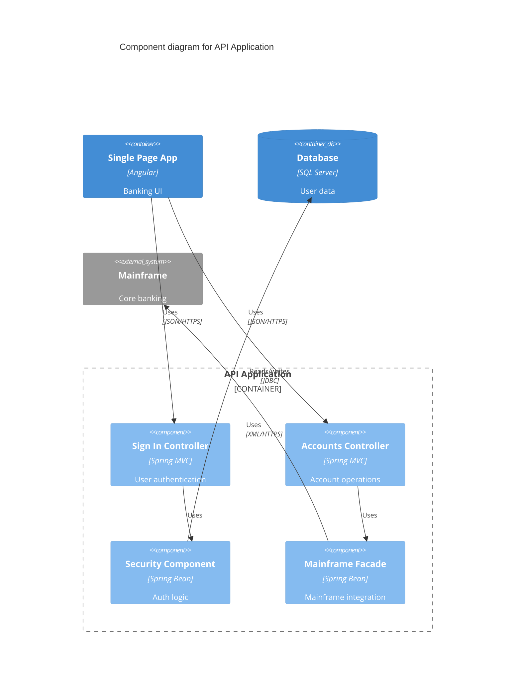
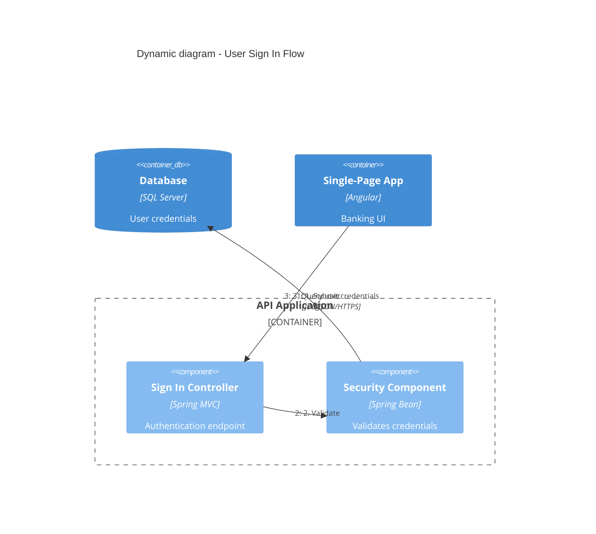
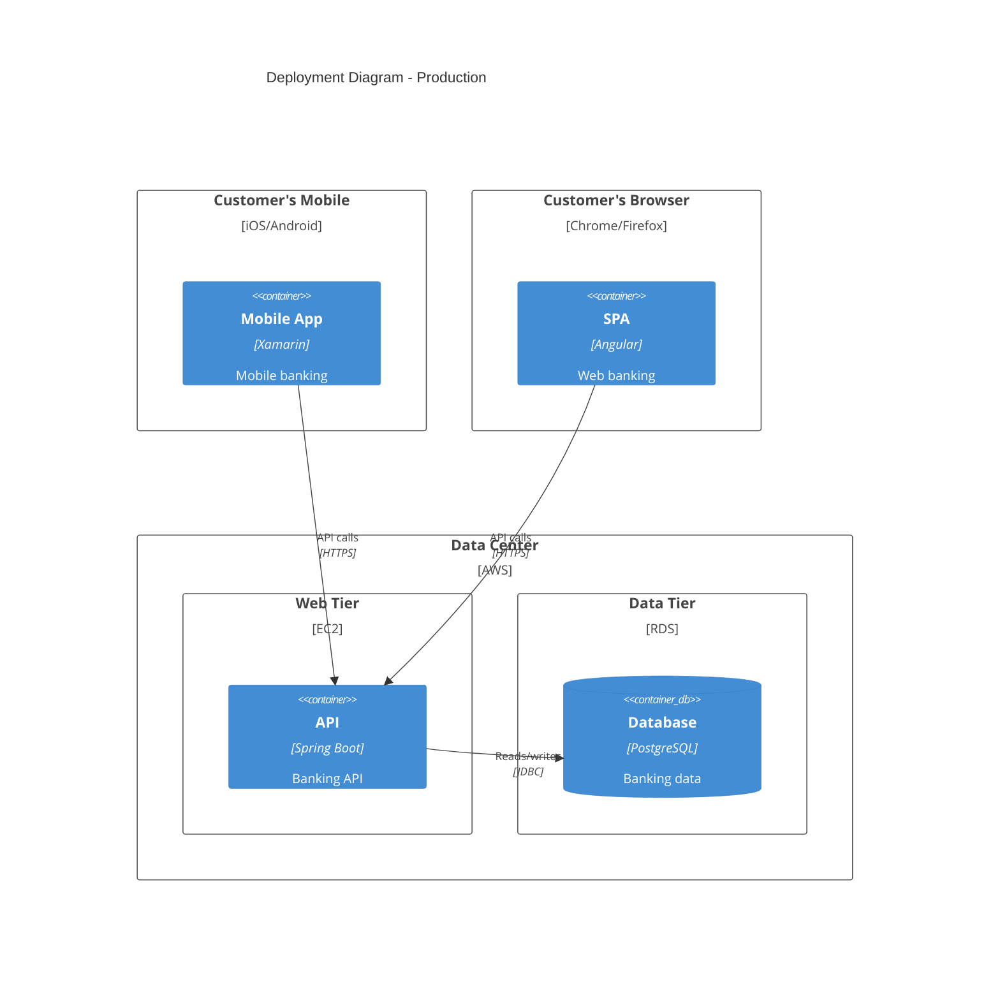
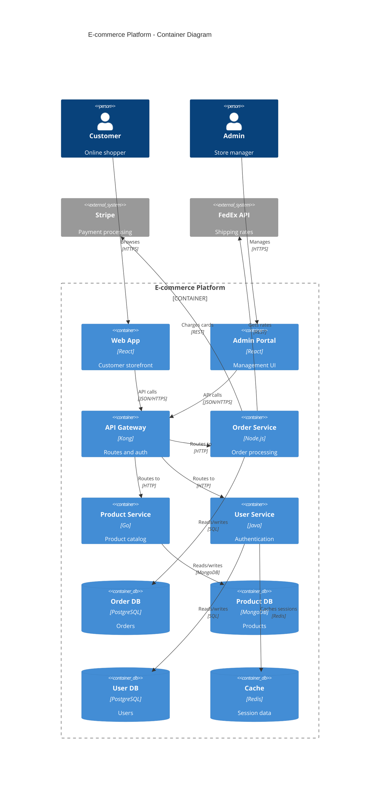
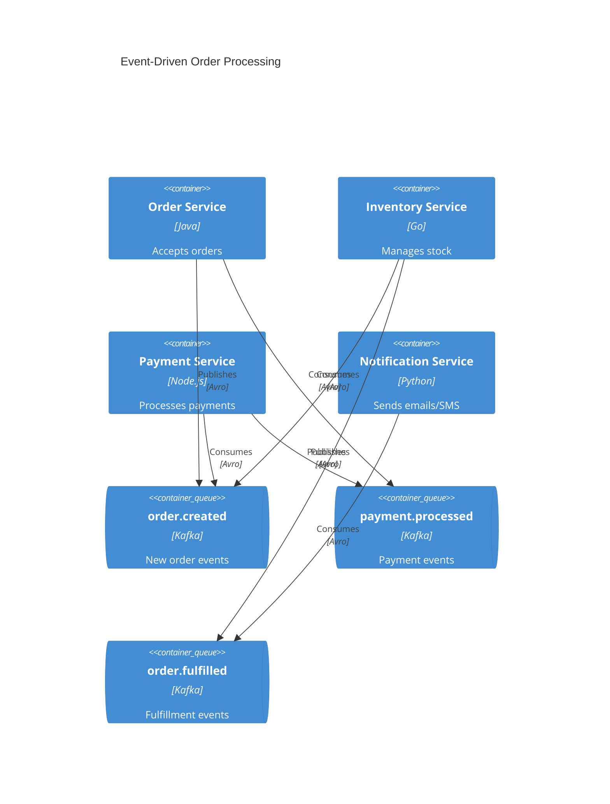

# C4 Mermaid Diagram Syntax Reference

Complete syntax reference for Mermaid C4 diagrams. Compatible with PlantUML C4 syntax.

## Table of Contents

1. [Diagram Types](#diagram-types)
2. [System Context Elements](#system-context-elements)
3. [Container Elements](#container-elements)
4. [Component Elements](#component-elements)
5. [Deployment Elements](#deployment-elements)
6. [Relationship Types](#relationship-types)
7. [Boundaries](#boundaries)
8. [Styling](#styling)
9. [Layout Configuration](#layout-configuration)
10. [Parameter Syntax](#parameter-syntax)
11. [Complete Examples](#complete-examples)
12. [Mermaid Limitations](#mermaid-limitations)

## Diagram Types

Start each diagram with the appropriate type declaration:

| Type | Declaration | Purpose |
|------|-------------|---------|
| System Context | `C4Context` | Shows system in context with users and external systems |
| Container | `C4Container` | Shows high-level technical building blocks |
| Component | `C4Component` | Shows internal components within a container |
| Dynamic | `C4Dynamic` | Shows request flows with numbered sequence |
| Deployment | `C4Deployment` | Shows infrastructure and deployment nodes |

## System Context Elements

### Person
```
Person(alias, label, ?descr)
Person_Ext(alias, label, ?descr)    # External person
```

### System
```
System(alias, label, ?descr)
System_Ext(alias, label, ?descr)    # External system
SystemDb(alias, label, ?descr)      # Database system
SystemDb_Ext(alias, label, ?descr)  # External database
SystemQueue(alias, label, ?descr)   # Message queue
SystemQueue_Ext(alias, label, ?descr)
```

## Container Elements

### Container
```
Container(alias, label, ?techn, ?descr)
Container_Ext(alias, label, ?techn, ?descr)
ContainerDb(alias, label, ?techn, ?descr)
ContainerDb_Ext(alias, label, ?techn, ?descr)
ContainerQueue(alias, label, ?techn, ?descr)
ContainerQueue_Ext(alias, label, ?techn, ?descr)
```

## Component Elements

### Component
```
Component(alias, label, ?techn, ?descr)
Component_Ext(alias, label, ?techn, ?descr)
ComponentDb(alias, label, ?techn, ?descr)
ComponentDb_Ext(alias, label, ?techn, ?descr)
ComponentQueue(alias, label, ?techn, ?descr)
ComponentQueue_Ext(alias, label, ?techn, ?descr)
```

## Deployment Elements

### Deployment Node
```
Deployment_Node(alias, label, ?type, ?descr) { ... }
Node(alias, label, ?type, ?descr) { ... }      # Shorthand
Node_L(alias, label, ?type, ?descr) { ... }    # Left-aligned
Node_R(alias, label, ?type, ?descr) { ... }    # Right-aligned
```

Deployment nodes can be nested:


## Relationship Types

### Basic Relationships
```
Rel(from, to, label)
Rel(from, to, label, ?techn)
Rel(from, to, label, ?techn, ?descr)
```

### Bidirectional
```
BiRel(from, to, label)
BiRel(from, to, label, ?techn)
```

### Directional Hints
```
Rel_U(from, to, label)    # Upward
Rel_Up(from, to, label)   # Upward (alias)
Rel_D(from, to, label)    # Downward
Rel_Down(from, to, label) # Downward (alias)
Rel_L(from, to, label)    # Leftward
Rel_Left(from, to, label) # Leftward (alias)
Rel_R(from, to, label)    # Rightward
Rel_Right(from, to, label)# Rightward (alias)
Rel_Back(from, to, label) # Reverse direction
```

### Dynamic Diagram Relationships
```
RelIndex(index, from, to, label)
```
Note: Index parameter is ignored; sequence determined by statement order.

## Boundaries

### Enterprise Boundary
```
Enterprise_Boundary(alias, label) {
  # Systems and people go here
}
```

### System Boundary
```
System_Boundary(alias, label) {
  # Containers go here
}
```

### Container Boundary
```
Container_Boundary(alias, label) {
  # Components go here
}
```

### Generic Boundary
```
Boundary(alias, label, ?type) {
  # Elements go here
}
```

## Styling

### Update Element Style
```
UpdateElementStyle(elementAlias, $bgColor, $fontColor, $borderColor, $shadowing, $shape)
```

Available parameters (all optional, use `$name=value` syntax):
- `$bgColor` - Background color
- `$fontColor` - Text color
- `$borderColor` - Border color
- `$shadowing` - Enable/disable shadow
- `$shape` - Element shape

### Update Relationship Style
```
UpdateRelStyle(from, to, $textColor, $lineColor, $offsetX, $offsetY)
```

Available parameters:
- `$textColor` - Label text color
- `$lineColor` - Line color
- `$offsetX` - Horizontal label offset (pixels)
- `$offsetY` - Vertical label offset (pixels)

**Tip:** Use `$offsetX` and `$offsetY` to fix overlapping relationship labels:


## Layout Configuration

```
UpdateLayoutConfig($c4ShapeInRow, $c4BoundaryInRow)
```

- `$c4ShapeInRow` - Number of shapes per row (default: 4)
- `$c4BoundaryInRow` - Number of boundaries per row (default: 2)

**Example - Reduce crowding:**


## Parameter Syntax

Two ways to pass optional parameters:

### Positional (in order)
```
Rel(customerA, bankA, "Uses", "HTTPS")
UpdateRelStyle(customerA, bankA, "red", "blue", "-40", "60")
```

### Named (with $ prefix, any order)
```
UpdateRelStyle(customerA, bankA, $offsetX="-40", $offsetY="60", $lineColor="blue")
```

## Complete Examples

### C4Context Example


### C4Container Example


### C4Component Example


### C4Dynamic Example


### C4Deployment Example


### E-commerce Microservices Example


### Event-Driven Architecture Example


### AWS Deployment Example
```mermaid
C4Deployment
  title Production Deployment - AWS

  Deployment_Node(cdn, "CloudFront", "CDN") {
    Container(static, "Static Assets", "S3", "HTML/CSS/JS")
  }

  Deployment_Node(vpc, "VPC", "10.0.0.0/16") {
    Deployment_Node(publicSubnet, "Public Subnet", "10.0.1.0/24") {
      Deployment_Node(alb, "Application Load Balancer", "ALB") {
        Container(lb, "Load Balancer", "AWS ALB", "Routes traffic")
      }
    }

    Deployment_Node(privateSubnet, "Private Subnet", "10.0.2.0/24") {
      Deployment_Node(ecs, "ECS Cluster", "Fargate") {
        Container(api1, "API Instance 1", "Node.js", "REST API")
        Container(api2, "API Instance 2", "Node.js", "REST API")
      }

      Deployment_Node(rds, "RDS", "Multi-AZ") {
        ContainerDb(primary, "Primary DB", "PostgreSQL", "Main database")
        ContainerDb(replica, "Read Replica", "PostgreSQL", "Read scaling")
      }
    }
  }

  Rel(cdn, alb, "Forwards requests", "HTTPS")
  Rel(lb, api1, "Routes to", "HTTP")
  Rel(lb, api2, "Routes to", "HTTP")
  Rel(api1, primary, "Writes to", "JDBC")
  Rel(api2, replica, "Reads from", "JDBC")
```

## Mermaid Limitations

The following PlantUML C4 features are not yet supported in Mermaid:

### Unsupported Features
- `sprite` - Custom icons
- `tags` - Element tagging
- `link` - Clickable links
- `Legend` - Auto-generated legends
- `AddElementTag` / `AddRelTag` - Tag styling
- `RoundedBoxShape` / `EightSidedShape` - Custom shapes
- `DashedLine` / `DottedLine` / `BoldLine` - Line styles
- Layout directives (`Lay_U`, `Lay_D`, `Lay_L`, `Lay_R`)

### Workarounds

**Layout Control:**
Use `UpdateLayoutConfig` to control shape positioning instead of layout directives.

**Overlapping Labels:**
Use `UpdateRelStyle` with `$offsetX` and `$offsetY` to move relationship labels.

**Complex Diagrams:**
Keep diagrams under 15 elements. Split complex architectures into multiple focused diagrams.

**Element Ordering:**
Elements appear in the order they are defined. Reorder statements to adjust layout.

### Alternative Tools

For features Mermaid doesn't support, consider:
- **Structurizr DSL** - Full C4 support with model-based generation
- **C4-PlantUML** - More mature C4 implementation
- **IcePanel** - Visual C4 diagram editor
