# Common C4 Model Mistakes to Avoid

This guide documents frequent anti-patterns and errors when creating C4 architecture diagrams, with examples of what to do instead.

## Abstraction Level Mistakes

### 1. Confusing Containers and Components

**The Problem:**
Containers are **deployable units** (applications, services, databases). Components are **non-deployable elements inside a container** (modules, classes, packages).

**Wrong - Java class shown as container:**
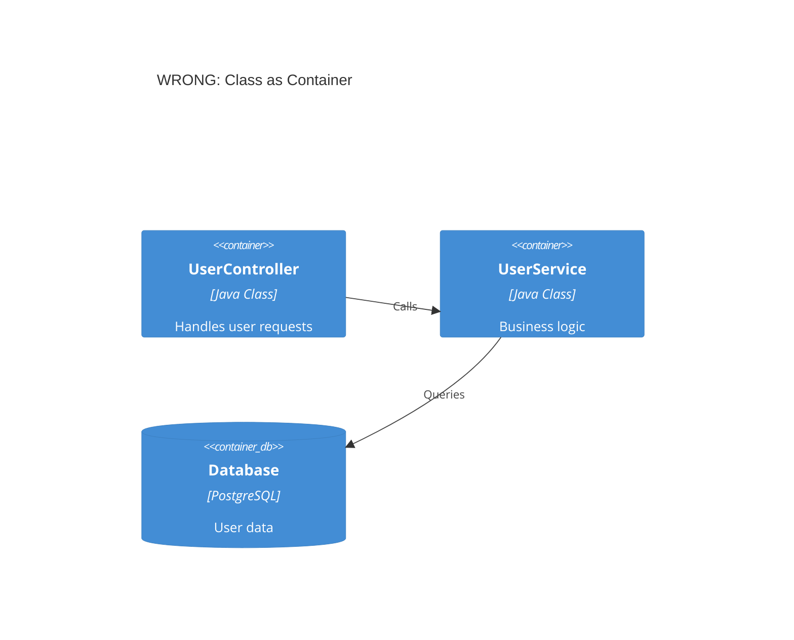

**Correct - Classes as components inside a container:**
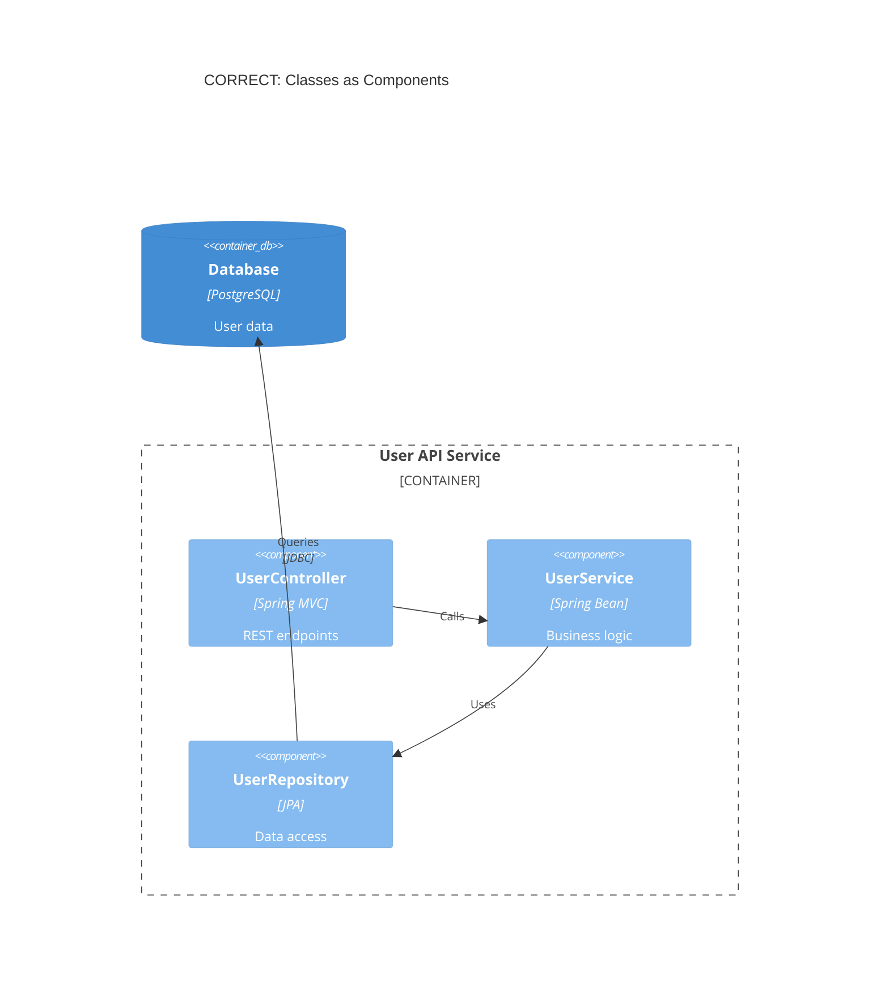

### 2. Adding Undefined Abstraction Levels

**The Problem:**
C4 defines exactly four levels. Don't invent "subcomponents", "modules", or other arbitrary levels.

**Wrong:**
- Level 3.5: "Subcomponents"
- Level 2.5: "Microservice groups"
- Custom levels like "packages" or "modules"

**Correct:**
Stick to Person, Software System, Container, Component. If you need more detail, you're at Level 4 (Code) which should use UML class diagrams.

### 3. Vague Subsystems

**The Problem:**
"Subsystem" is ambiguous. Is it a system, container, or component?

**Wrong:**
```
Subsystem(orders, "Order Subsystem", "Handles orders")
```

**Correct - Be specific:**
```
System(orderSystem, "Order System", "Handles order lifecycle")
# OR
Container(orderService, "Order Service", "Java", "Order processing API")
# OR
Component(orderProcessor, "Order Processor", "Spring Bean", "Order business logic")
```

## Shared Libraries Mistake

**The Problem:**
Modeling a shared library as a container implies it's an independently running service. Libraries are copied into applications, not deployed separately.

**Wrong - Library as separate container:**
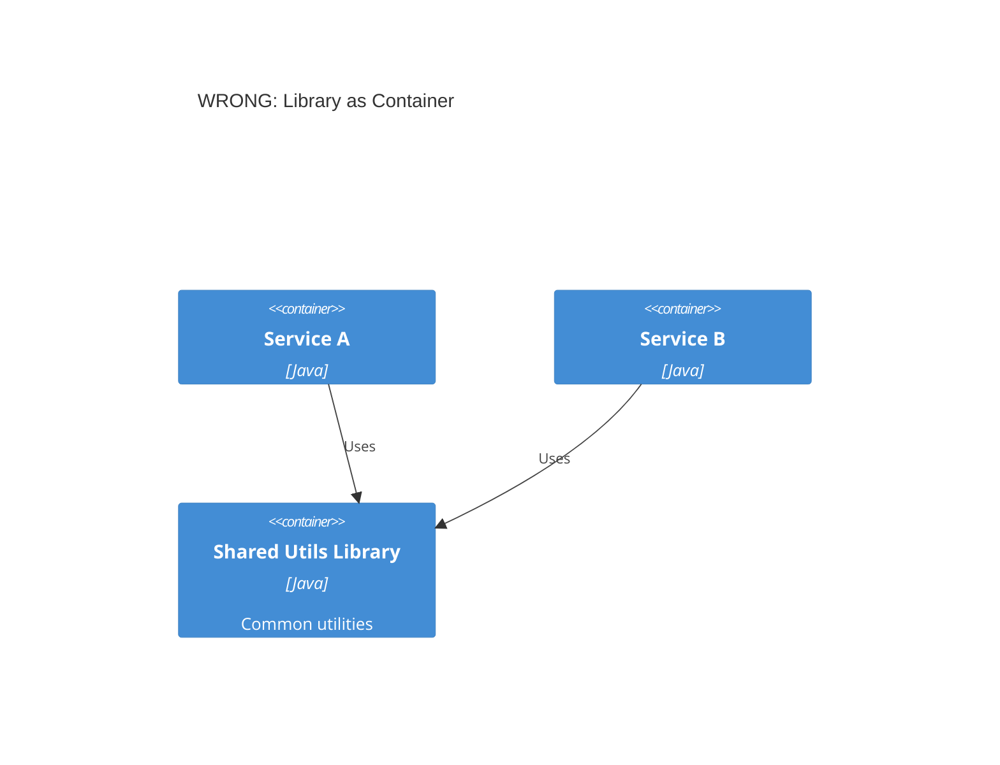

**Correct - Show library within each service:**
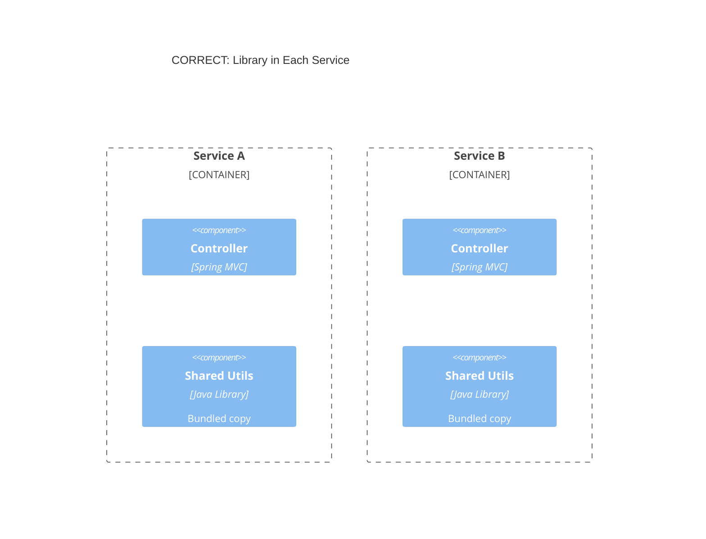

Or simply omit the library from architecture diagrams since it's an implementation detail.

## Message Broker Mistakes

### Single Message Bus Anti-Pattern

**The Problem:**
Showing Kafka/RabbitMQ as a single container creates a misleading "hub and spoke" diagram that hides actual data flows.

**Wrong - Central message bus:**
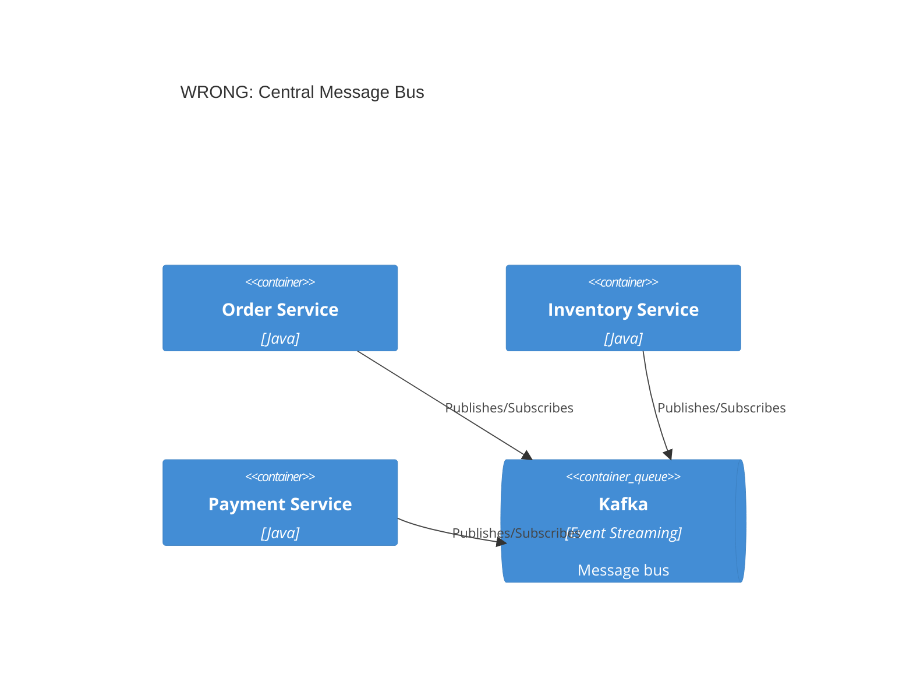

**Correct - Individual topics:**
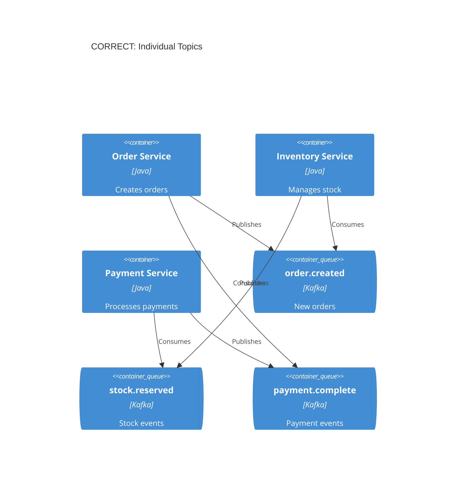

**Alternative - Topics on relationship labels:**
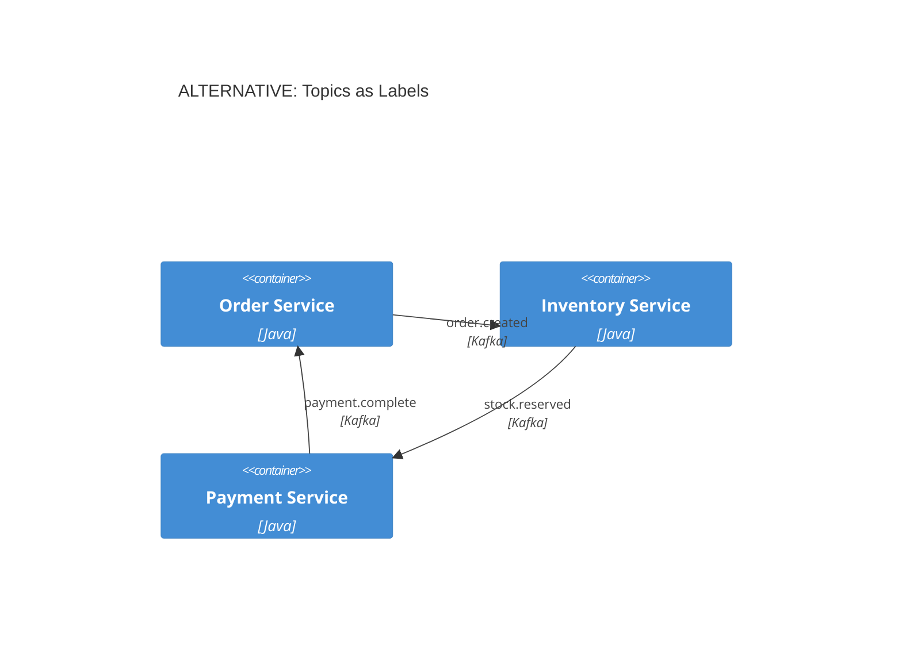

## External Systems Mistakes

### Showing Internal Details of External Systems

**The Problem:**
You don't control external systems. Showing their internals creates coupling and becomes stale quickly.

**Wrong - External system internals:**
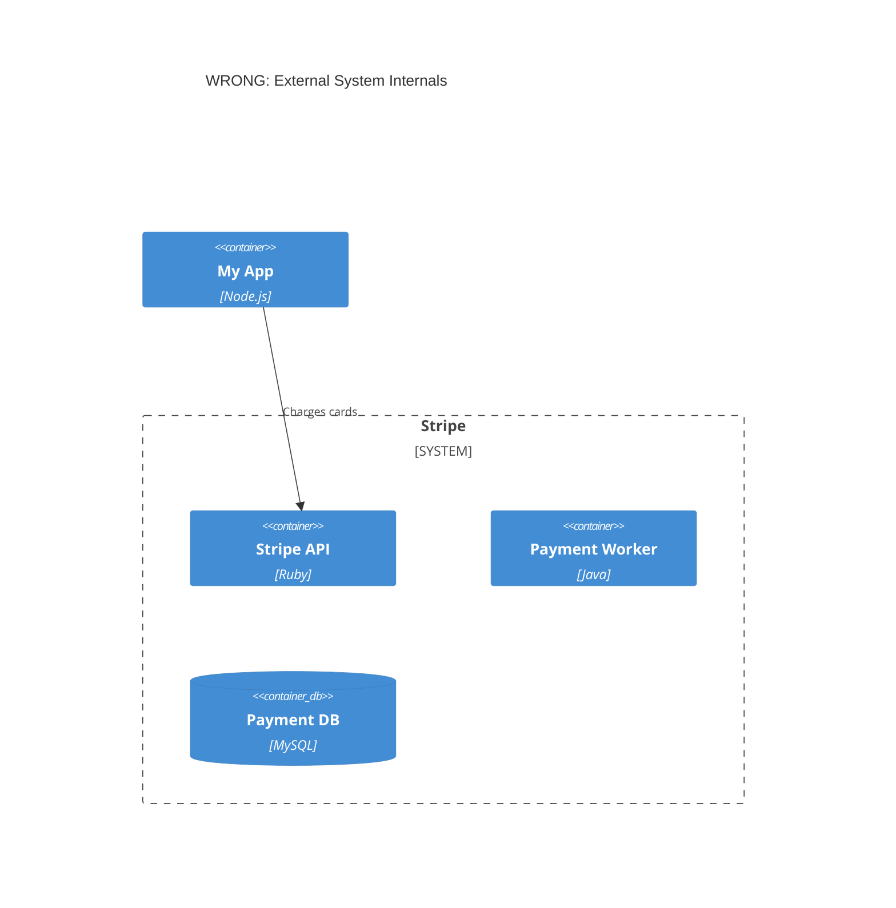

**Correct - External system as black box:**
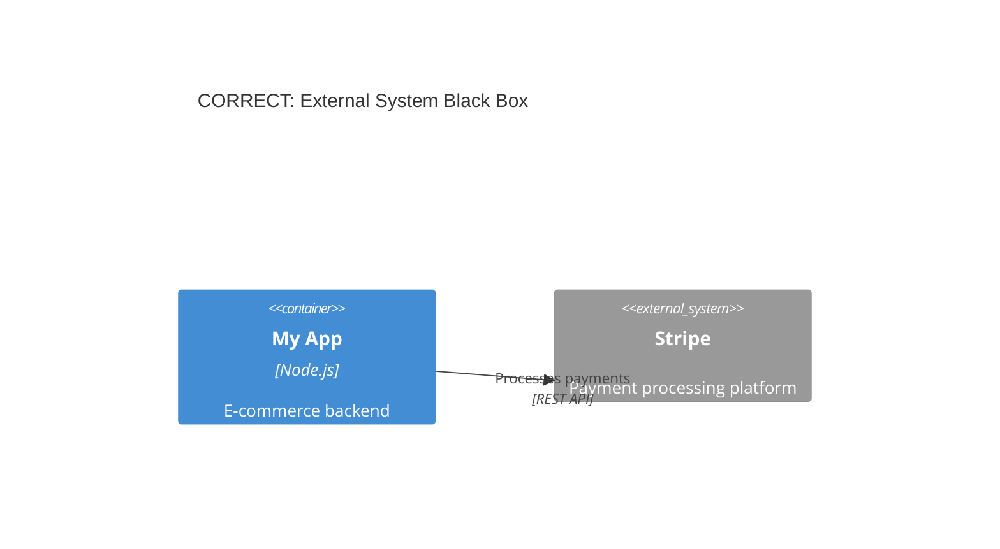

## Metadata and Documentation Mistakes

### 1. Removing Type Labels

**The Problem:**
Removing element type labels (Container, Component, System) to "simplify" diagrams creates ambiguity.

**Wrong:**
```
Box(api, "API")  # What is this? System? Container? Component?
```

**Correct:**
```
Container(api, "API Application", "Spring Boot", "REST API backend")
```

### 2. Missing Descriptions

**The Problem:**
Elements without descriptions force viewers to guess their purpose.

**Wrong:**
```
Container(svc, "Service", "Java")
```

**Correct:**
```
Container(orderSvc, "Order Service", "Spring Boot", "Manages order lifecycle and fulfillment")
```

### 3. Generic Relationship Labels

**The Problem:**
Labels like "uses" or "communicates with" don't explain what data flows or why.

**Wrong:**
```
Rel(frontend, api, "Uses")
Rel(api, db, "Accesses")
```

**Correct:**
```
Rel(frontend, api, "Fetches products, submits orders", "JSON/HTTPS")
Rel(api, db, "Reads/writes order data", "JDBC")
```

## Diagram Scope Mistakes

### 1. Not Tailoring to Audience

**The Problem:**
Showing Level 4 code diagrams to executives, or only Level 1 to developers who need implementation details.

| Audience | Appropriate Levels |
|----------|-------------------|
| Executives | Level 1 (Context) only |
| Product Managers | Levels 1-2 |
| Architects | Levels 1-3 |
| Developers | All levels as needed |
| DevOps | Levels 2 + Deployment |

### 2. Creating All Four Levels by Default

**The Problem:**
Not every system needs all four levels. Level 3 (Component) and Level 4 (Code) often add no value.

**Guidance:**
- **Always create:** Context (L1) and Container (L2)
- **Create if valuable:** Component (L3) for complex containers
- **Rarely create:** Code (L4) - let IDEs generate these

### 3. Too Many Elements Per Diagram

**The Problem:**
Diagrams with 20+ elements become unreadable.

**Simon Brown's advice:** "If a diagram with a dozen boxes is hard to understand, don't draw a diagram with a dozen boxes!"

**Solutions:**
- Split by bounded context or domain
- Create separate diagrams per service
- Show one service + its direct dependencies
- Use multiple focused diagrams instead of one comprehensive diagram

## Arrow Mistakes

### 1. Bidirectional Arrows

**The Problem:**
Bidirectional arrows are ambiguous. Who initiates the call? What flows each direction?

**Wrong:**
```
BiRel(frontend, api, "Data")  # Ambiguous direction
```

**Correct:**
```
Rel(frontend, api, "Requests products", "JSON/HTTPS")
Rel(api, frontend, "Returns product data", "JSON/HTTPS")
```

Or show the initiator's perspective:
```
Rel(frontend, api, "Fetches products", "JSON/HTTPS")
```

### 2. Unlabeled Arrows

**The Problem:**
Arrows without labels force readers to guess what flows between elements.

**Wrong:**
```
Rel(orderSvc, paymentSvc)
```

**Correct:**
```
Rel(orderSvc, paymentSvc, "Requests payment authorization", "gRPC")
```

## Deployment Diagram Mistakes

### 1. Deployment Details in Container Diagrams

**The Problem:**
Container diagrams should show logical architecture, not infrastructure details.

**Wrong - Infrastructure in container diagram:**
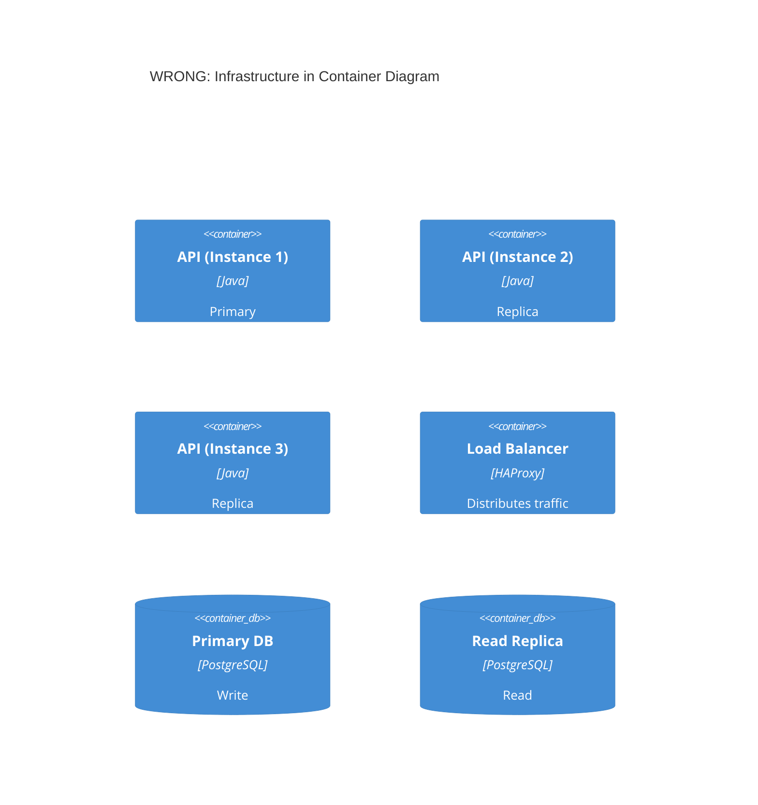

**Correct - Use Deployment diagram for infrastructure:**
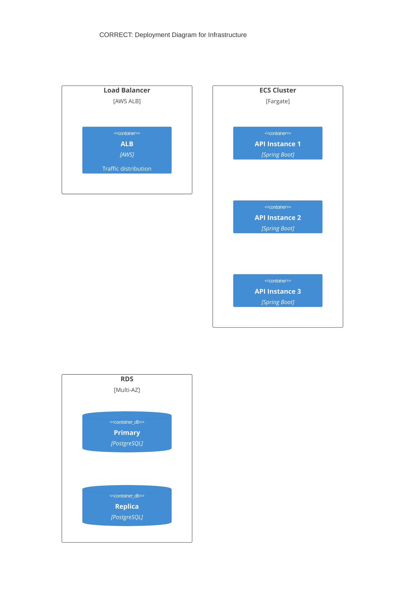

### 2. Missing Environment Context

**The Problem:**
Deployment diagrams should specify which environment (production, staging, dev).

**Wrong:**
```
C4Deployment
  title Deployment Diagram  # Which environment?
```

**Correct:**
```
C4Deployment
  title Deployment Diagram - Production (AWS us-east-1)
```

## Consistency Mistakes

### 1. Inconsistent Notation Across Diagrams

**The Problem:**
Using different colors, shapes, or terminology for the same elements across diagrams.

**Wrong:**
- Context diagram: "Payment System" (blue)
- Container diagram: "Payment Service" (green)
- Component diagram: "Payment Module" (red)

**Correct:**
Use consistent naming, colors, and styling. Create a style guide for your team.

### 2. No Legend/Key

**The Problem:**
Assuming viewers understand your notation without explanation.

**Solution:**
Always include a legend explaining colors, shapes, and line styles. Even for "obvious" elements.

## Decision Documentation Mistakes

### Showing Decision Process in Diagrams

**The Problem:**
Architecture diagrams show **outcomes** of decisions, not the decision-making process.

**Wrong approach:**
Including "Option A vs Option B" annotations in diagrams.

**Correct approach:**
- Document decisions separately in Architecture Decision Records (ADRs)
- Link ADRs to relevant diagrams
- Diagrams show the chosen architecture, ADRs explain why

## Quick Reference: Checklist

Before finalizing any C4 diagram, verify:

- [ ] Every element has: name, type, technology (if applicable), description
- [ ] All arrows are unidirectional with action verb labels
- [ ] Technology/protocol included on relationships
- [ ] Diagram has a clear, specific title
- [ ] Under 20 elements (ideally under 15)
- [ ] Appropriate level for the target audience
- [ ] Containers are deployable, components are not
- [ ] External systems shown as black boxes
- [ ] Message topics shown individually (not as single broker)
- [ ] No infrastructure details in container diagrams
- [ ] Consistent with other diagrams in the set
